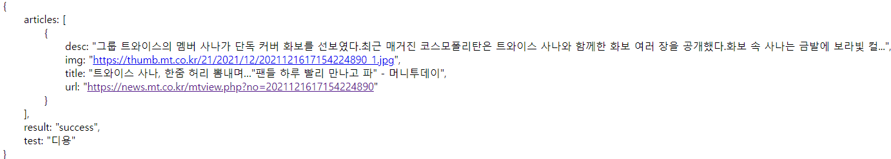
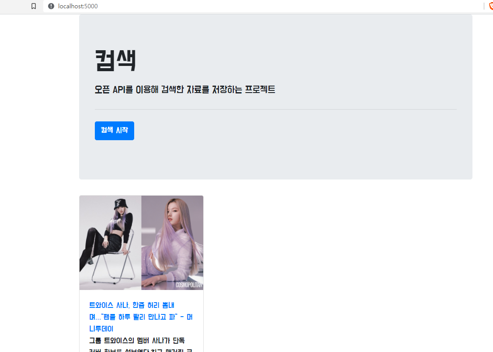

# Python Scrapping

이 곳은 웹개발의 한 사이클을 경험해보기 위해 만든 저장소입니다. 
SW사관학교 정글에서 배부한 자료를 통해 학습했습니다. 저작권을 침해하지 않기 위해 저장소에 올라간 프로젝트는 정글의 자료와 관계가 없음을 알립니다.

## 학습 목표

- Python언어로 웹 애플리케이션 개발 한 주기를 경험한다.
- 이후 Java로 웹 개발을 할 때 도움이 될 수 있도록 서버에 대한 지식을 중점적으로 학습하자.
- 일단 프로젝트를 빠르게 완성하는 것을 목표로 한다. 중간에 모르는 개념은 따로 목록을 만들어 둔다.
- 프로젝트 완성 후, 몰랐던 개념을 구글링을 통해 정리하며 내 것으로 만든다.

## 기획

1. 간단한 index페이지에서 검색
2. 오픈 api를 이용하여 검색 결과를 mongoDB에 저장
3. 저장된 list를 띄워준다.
4. AWS를 이용하여 배포한다.
5. 사놓은 도메인에 ip주소를 연동한다.

### 사용한 기술 스택

#### 프론트엔드
- 언어: JS
- 라이브러리: jQuery

#### 백엔드
- 언어: Python
- 서버: Flask
- DB: MongoDB
- 배포: Amazon EC2

## study list

- app.py에서 정의한 함수 동작 원리 이해하기

ex)

```
@app.route('/memo', methods=['GET'])
def read_list():
    result = list(db.comsec.find({}, {'_id': False}))
    return jsonify({'result': 'success', 'articles': result})
```
- flask의 request와 파이썬의 requests의 차이점

```return jsonify({'result': 'success', 'articles': result, 'test': "디용"})```


- 위에서 리턴형식 이해하기
- post 에서 data{} 부분 원리
- jsonify
    
      if __name__ == '__main__':
      app.run('0.0.0.0', port=5000, debug=True)
- 위의 코드 의미

## 프로젝트 진행 과정

### First commit

구현 목록:
- url을 입력하면 썸네일과 제목, 설명을 json형식으로 추출한다.
- 만들어둔 데이터를 mongodb에 저장한다.
- 서버에서 db에 저장된 목록을 읽어 card 형식으로 만든다.
- card를 post한다.



다음에 구현할 기능:
- url을 입력하는 부분을 검색어로 대체한다.
- 오픈 API를 이용하여 해당 검색어를 입력했을 때 결과를 추출한다.
- 추출한 결과를 db에 저장한다.