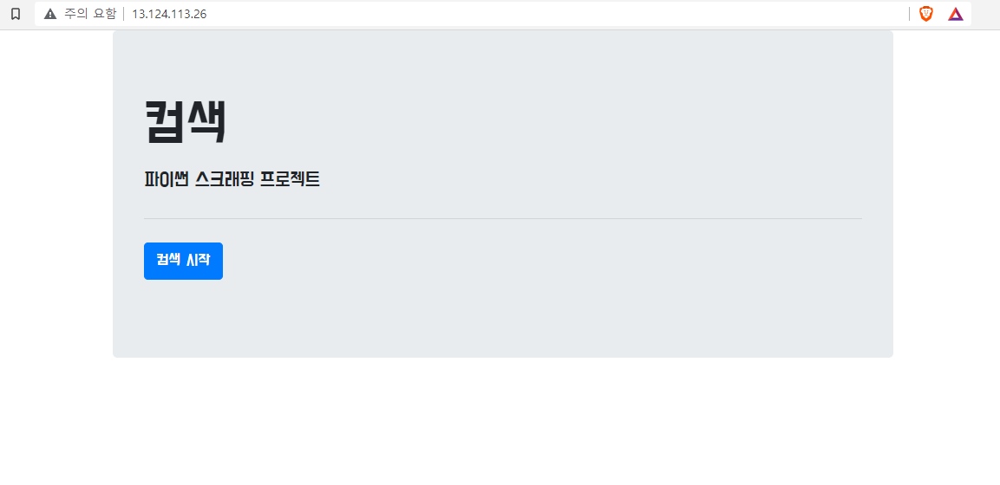

# Python Scrapping

이 곳은 웹 애플리케이션 개발의 한 주기를 경험해보기 위해 만든 저장소입니다. SW사관학교 정글에서 배부한 자료를 통해 학습했습니다. 저작권을 침해하지 않기 위해 저장소에 올라간 프로젝트는 정글의 자료와 관계가 없음을 알립니다.

## 학습 목표

- Python언어로 웹 애플리케이션 개발 한 주기를 경험한다.
- 이후 Java로 웹 개발을 할 때 도움이 될 수 있도록 서버에 대한 지식을 중점적으로 학습하자.
- 일단 프로젝트를 빠르게 완성하는 것을 목표로 한다. 중간에 모르는 개념은 따로 목록을 만들어 둔다.
- 프로젝트 완성 후, 몰랐던 개념을 구글링을 통해 정리하며 내 것으로 만든다.

## 기획

1. 간단한 index페이지에서 검색
2. 검색 결과를 mongoDB에 저장
3. 저장된 list를 띄워준다.
4. AWS를 이용하여 배포한다.
5. 사놓은 도메인에 ip주소를 연동한다.

### 사용한 기술 스택

#### 프론트엔드

- 언어: JS
- 라이브러리: jQuery

#### 백엔드

- 언어: Python
- 서버: Flask
- DB: MongoDB
- 배포: Amazon EC2

## study list

- API란 무엇인가
- app.py에서 정의한 함수 동작 원리 이해하기

ex)

```
@app.route('/memo', methods=['GET'])
def read_list():
    result = list(db.comsec.find({}, {'_id': False}))
    return jsonify({'result': 'success', 'articles': result})
```

- flask의 request와 파이썬의 requests의 차이점

```return jsonify({'result': 'success', 'articles': result, 'test': "디용"})```


- 위에서 리턴형식 이해하기
- post 에서 data{} 부분 원리
- jsonify

      if __name__ == '__main__':
      app.run('0.0.0.0', port=5000, debug=True)
- 위의 코드 의미
- 선택자 사용 방법:

```
i.text: i 중에 text 가져오기
i['link']: i 중에 link 속성값 가져오기
a_tag = i.select_one('div.total_area > a')
        title = a_tag.text
        여기서 select와 select_one일때 .text 사용
```

- SSH와 22번 포트
- 5000 포트: flask 기본 포트 (톰켓 8080같은거인듯)
- HTTP 통신에 대한 개념 

## 프로젝트 진행 과정

### First commit

구현 목록:

- url을 입력하면 썸네일과 제목, 설명을 json형식으로 추출한다.
- 만들어둔 데이터를 mongodb에 저장한다.
- 서버에서 db에 저장된 목록을 읽어 card 형식으로 만든다.
- card를 post한다.


다음에 구현할 기능:

- url을 입력하는 부분을 검색어로 대체한다.
- 해당 검색어를 입력했을 때 결과를 추출한다.

### Second commit

구현 목록:

- 검색어 입력시 검색 결과를 추출한다.


다음에 구현할 기능:

- 타이틀 이외에 썸네일 사진, 설명, 링크를 같이 추출한다.

프로젝트 수정 사항:

- 원래 기획: 네이버 비로그인 오픈 API와 연동하기
- 수정: 일반적인 네이버 웹 스크래핑
- 이유: 이 프로젝트의 목적을 상기하자. SW사관학교 정글에서 배부한 자료를 나의 방식으로 학습하기 + 백엔드 지식 학습이다. 새로운 것을 학습하기 보다는 몰랐던 지식을 알아가는 것에 집중하자.

### Third commit

구현 목록:

- 검색어 입력시 타이틀, 썸네일 사진, 설명, 링크를 모두 추출한다.


다음에 구현할 기능:

- 추출한 데이터를 Mongo DB에 저장하기

### Fourth commit

구현 목록:

- 검색한 데이터를 database에 card형식으로 저장


다음에 구현할 기능:

- mongoDB에서 모든 데이터 조회하기
- card라는 키값으로 정보 보내주기

### Fifth commit

구현 목록: 

- DB에 있는 데이터를 읽어 card형식으로 post
- DB 삭제를 누르면 테이블 drop


### 중간 점검

파이썬으로 백엔드를 구현해보며 API가 무엇인지에 대해 조금씩 이해하고있다. 내가 이해한 것을 간단하게 설명하자면,

- API란 클라이언트와 서버와의 통신을 이어주는 매개체이다.

클라이언트가 명령어를 실행하기 위해 코드를 입력해아한다. 그런데 코드를 입력할 수 있는 방법이 없다. 나야 편집기를 통해 직접 코드를 쓰지만, 클라이언트 입장에선 서버에 직접 명령을 전달할 수단이 없는 것이다.

- 브라우저가 이 역할을 대신한다.


```  
@app.route('/comsec', methods=['GET'])
  def comsec_read():
  result = list(db.comsec.find({}, {'_id': False}))

  return jsonify({'result': 'success', 'card': result})
```

브라우저에서 /comsec라는 주소로 들어가면 서버는 다음의 명령을 수행한다.

- 데이터베이스에서 comsec 테이블을 찾아 보여주어라

클라이언트 입장에선 주소창에 명령어를 일일이 치지 않아도 된다. 


```$(document).ready(function () {
$("#cards-box").html("");
comsecRead();
});
```

위와 같은 코드를 통해 저절로 명령어를 실행시키거나, 버튼에 onclick() 함수 등을 이용하는 방법이 있기 때문이다.

### 다음에 구현할 기능

지금까지 간단한 웹 애플리케이션을 만들어보았다. 이번엔 이를 직접 서버에 배포해보자.

- Amazon EC2에 애플리케이션 파일 올리기
- 서버를 구동시켜 외부에서 접속할 수 있는 환경 만들기
- 도메인과 연결하기

### EC2 배포

- EC2 ubuntu에 애플리케이션 업로드
- vim을 사용하여 app.py에 db 아이디, 비밀번호 업데이트 


- 애플리케이션 실행 뒤, 브라우저를 통해 접속해보자.




- 검색도 해보자 (API를 검색할 경우)


- DB를 drop해보자


문제 없이 실행된다. 이제 내 퍼블릭 IP주소에 도메인을 연동시켜보자.

http://comsun.shop


### 프로젝트를 마치며

사실 공부는 지금부터 시작이다. 이 프로젝트에서 중요한 것은 내가 몰랐던 부분을 인지하고 기록하는 것에 있었다. 지금부터는 동작 원리를 이해하는 방향으로 학습하자.


---

- GET: 리소스 요청
- POST: 서버에 내용(파일 포함) 전송, 서버에 리소스 새로 생성, update

### Flask 동작 원리

실습 과정에서 모르고 사용했던 Flask의 동작 원리에 대해 알아보자.


```
from flask import Flask 
app = Flask(__name__) 
```

flask 모듈을 임포트한다.
app에 Flask()를 넘겨서 app 전역 객체로 사용할 수 있게 한다. (인스턴스 생성)

`__name__`: 파이썬에서 내부적으로 사용하는 특별한 변수. Flask app에선 리소스를 찾는데 사용한다.

```
if __name__ == '__main__':
  app.run()
```
프로그램의 시작점. 다른 언어에서 main 엔트리 포인트.
애플리케이션을 실행할 때 -python app.py를 입력한다. 이 경우 `__name__`의 값은 `__main__`이 된다. 즉, 프로그램의 시작점이 된다. 이 경우  app.run()이 실행된다.

만약 app.py를 외부 모듈로 사용하는 경우, `__name__`은 app이라는 이름으로 나오게 되어 app.run()이 실행되지 않는다.

```
@app.route('/') 
```
- 데코레이터: app 객체의 route 함수에 request 인자를 넘기면서 HTTP 요청을 처리한다.


```
def hello():
 return 'Hello, World!' 
```

- @app.route 데코레이터 URL과 이 함수를 연결한다.

### request

- Flask에서 request 정의: `In the client-server architecture, the request object contains all the data that is sent from the client to the server.`
- Python에서 request 정의: `Requests is an Apache2 Licensed HTTP library, written in Python. It is designed to be used by humans to interact with the language. `

둘의 명확한 차이:

- Flask request: `Flask is a web framework which clients make requests to. The Flask request object contains the data that the client (eg a browser) has sent to your app - ie the URL parameters, any POST data, etc.`

Flask에서 request`객체`는 클라이언트가 애플리케이션에 전달한 데이터 (POST) 등을 갖는다.

- Python request: `The requests library is for your app to make HTTP request to other sites, usually APIs. It makes an outgoing request and returns the response from the external site.`

Python에서 request 는 `라이브러리`이다. 애플리케이션에서 다른 사이트에 API와 같은 HTTP Request를 만들기 위해 있는 라이브러리이다. outgoing request를 만들고, 외부의 사이트에서 response를 반환한다.

- 한 줄 요약: Flask에서 request는 '객체', python에서는 '라이브러리'이다.

### jsonify

우선 다음의 코드와 결과를 보자.

```return jsonify({'result': 'success', 'articles': result, 'test': "디용"})```


JSON은 자료형 리스트와 딕셔너리(key, value를 한 쌍으로 갖는 자료형)를 섞어놓은것처럼 생겼다.

위 코드의 결과를 보면 List자료형

- articles: ...
- result :success
- test: 디용

이 있고, 그 와중에 articles는 딕셔너리 자료형 모양임을 확인할 수 있다.

- desc: ...
- img: ...
- title: ...
- url: ...

return 의 결과를 하나하나 해석해보자.

- articles: result라는 변수를 return한다. 여기서 result는 app.py에서 정의한 결과이다. 
- result: 'success'라는 단어 자체를 return한다.
- test" '디용'이라는 단어 자체를 return한다.


jsonify: `Flask jsonify is defined as a functionality within Python’s capability to convert a JSON output into a response object with application/json mimetype by wrapping up a dumps( ) function for adding the enhancements.
 Along with the conversion of json to an output response, this function helps in conversion of multiple arguments to array or multiple arguments into dictionary.`

### SSH

SSH: Secure Shell Protocol - 네트워크의 프로토콜중 하나이다. 컴퓨터와 컴퓨터가 통신을 할 때 보안적으로 안전하게 통신하기 위해 사용된다.

### HTTP

HTTP: HyperText Transfer Protocol - HTML파일을 전송하는 프롵토콜.

네트워크 프로토콜에 대한 전반적인 개념을 학습해야겠다. 이 부분은 나중에 Repo 하나를 할애해서 다시 학습할 예정